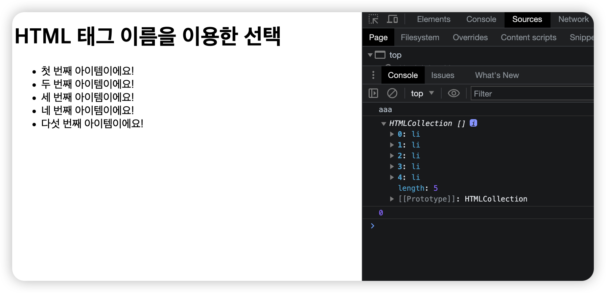

# 💡 Agenda - 스크립트가 위에 배치해도 요소를 받아오긴하네?의 문제 랄까?

> ## 📌 " html 문서 앞에 script 태그 내에 js코드를 작성했고, 문서가 로드 되기 전에 script의 element를 가져오지 못한 상태에서 console.log로 디버그하여 개발자도구에 확인해보았을때는 왜 element(li 태그)를 반환했는지 원인이 궁금하다. " -

```js
<!DOCTYPE html>
<html lang="ko">
  <head>
    <meta charset="UTF-8" />
    <title>JavaScript DOM Element</title>
    <script>
      //HTML 태그 이름을 이용한 선택

      //여기는 일단 실행 1번
      console.log("aaa");
      var selectedItem = document.getElementsByTagName("li");
      // 모든 <li> 요소를 선택함.
      //가져오는 것까지 성공 2번
      console.log(selectedItem);
      //그래서 콘솔 찍으면 li 태그들을 가져오긴 함
      console.log(selectedItem.length);
      //length까지도 확인이 됨

      selectedItem.item(1).style.color = "red";

      for (var i = 0; i < selectedItem.length; i++) {
        selectedItem.item(i).style.color = "red";
        // 선택된 모든 요소의 텍스트 색상을 변경함.
        console.log(selectedItem.item(i));
      }
    </script>
  </head>
  <body>
    <!-- 마지막으로 여기에 있는 것들이 실행된 것으로 추정 !  -->
    <h1>HTML 태그 이름을 이용한 선택</h1>
    <ul>
      <li>첫 번째 아이템이에요!</li>
      <li>두 번째 아이템이에요!</li>
      <li>세 번째 아이템이에요!</li>
      <li>네 번째 아이템이에요!</li>
      <li>다섯 번째 아이템이에요!</li>
    </ul>
  </body>
</html>

```

```basic
구조를 먼저 보도록 하면,
문서의 형태: html
문서의 구조: <head> 내부에 <script> 내용이 들어가 있고, <body>내부에 html 마크업이 되어있는 상태.
```

#### ⭐ 참고: 일반적으로 script를 body태그 내부의 html 마크업 아래에 적는 것이 일반적임

### 콘솔창 확인해보자 !



```basic
HTMLCollection 안에 유사배열 형태로 body태그 안에 있는 li 태그를 받아온 것을 확인 !
```

#### 그런데 ! 왜🤔?

```basic
script 태그 안에 작성된 스타일이 적용되지 않는걸까?
```

## 🖥 접근방식 1. getElementsByTagName("li") 호출의 문제일까?

1. getElementsByTagName("li") 호출은 JavaScript 코드가 head 섹션에 배치된 경우에도 DOM에서 "li" 요소를 검색
2. DOM은 HTML이 파싱되면서 생성되며 스크립트가 head 섹션에 있더라도 body 섹션의 요소는 이미 파싱되어 액세스할 수 있음
3. document.getElementsByTagName("li")을 사용하면 실제로 body의 "ul"에 있는 5개의 "li" 요소가 있는 HTMLCollection을 반환

## 🖥 접근방식 2. 실행시점의 문제?

1. head 섹션에 스크립트를 배치하면 body 콘텐츠가 렌더링되기 전에 스크립트가 실행
2. 따라서 for 루프가 실행되고
3. style.color = "red" 코드가 요소에 적용됨
4. 요소 자체는 아직 페이지에 표시되지 않음
5. 따라서 결과적으로 시각적 변화를 관찰하지 못할 수 도 있음

## 🖥 접근방식 3. getElementsByTagName("li")가 반환한 HTMLCollection의 문제일까?

1. HTMLCollection의 동적 특성: document.getElementsByTagName("li") 호출은 DOM에서 "li" 요소의 라이브 HTMLCollection을 검색
2. HTMLCollection은 기준(이 경우 "li" 요소)과 일치하는 DOM의 변경 사항을 반영하기 위해 실시간으로 업데이트

## 🖥 접근방식 4. 스크립트 배치의 문제일까? (당연한 얘기..)

1. JavaScript 코드는 head 섹션 안에 배치
2. 브라우저가 head 섹션에서 스크립트를 발견하면 전체 HTML 콘텐츠가 구문 분석 및 렌더링되기 전에 스크립트 실행을 시작
3. 이는 JavaScript 코드가 실행 중이고 li 요소가 페이지에 표시되기 전에 텍스트 색상을 빨간색으로 변경하려고 시도

## 🖥 접근방식 5. 스크립트 안에 for문이 실행되지 않는걸까?

1. 브라우저가 위에서 아래로 HTML 구문 분석을 시작, head 섹션에서 script 태그를 만나면 나머지 HTML 문서가 완전히 구문 분석되기 전에 스크립트 실행을 시작
2. console.log("aaa") 문이 실행되고 콘솔에 "aaa"가 표시
3. document.getElementsByTagName("li")이 호출되어 모든 "li" 요소를 선택 + 이 시점에서 브라우저가 여전히 body 섹션을 구문 분석하고 있기 때문에 "ul" 및 "li" 요소는 아직 구문 분석되거나 생성되지 않음
4. console.log(selectedItem) 및 console.log(selectedItem.length) 명령문은 이 시점에서 사용할 수 있는 "li" 요소가 없기 때문에 빈 HTMLCollection 및 length는 0으로 콘솔창에 기록됨
5. 'for' 루프는 'selectedItem.length'가 0인 상태에서 실행되므로 'HTMLCollection'에 요소가 없기 때문에 루프 본문이 실행되지 않음

# 🌟 결론 !

## 🩷"렌더링 순서"🩷의 문제다.

그러니깐, JS 스크립트를 먼저 읽는 동안 브라우저는 동시에 HTML에 적힌 내용을 해석하는데, 해석하는 동안에 JS 스크립트는 이미 적용됐지만 ! HTML에 적힌 내용은 아직 렌더되지 못한 상황에서 JS 스크립트가 렌더되어 버림. HTML의 속성이 for문 안으로 들어가서 적용되기 전에 이미 for문에 해당하는 것들이 HTML li 태그의 list를 가져오지 못한 상태에서 미리 돌아가버린 것.

#### 😂 그냥 주절주절 😂

내가 이번 문제를 접근한 방법.....
<br>
불러오는 web api 종류가 이상했던 모양이다. 아닌가?
<br>
web api로 반환된 HTMLCollection의 특징인듯. 아닌가?
<br>
실행시...저..ㅁ.아 이거라고?
<br>
역시 스크립트 배치의 문제인듯! 아니 그럼 li 태그를 왜 가져온거야? 아...for문을 못읽네ㅋㅋㅋ
<br>
렌더링 시점의 차이였어..!
