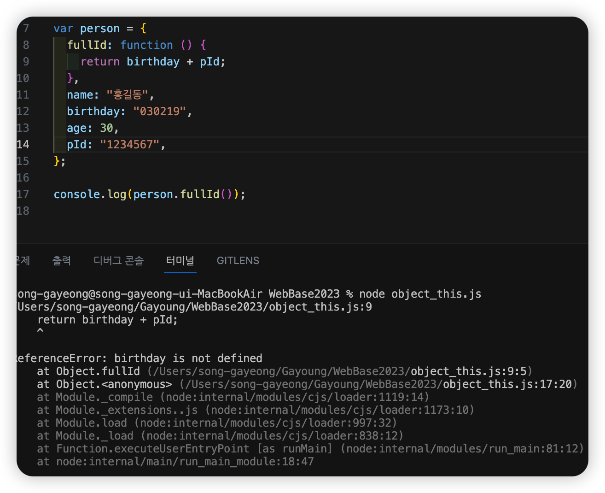
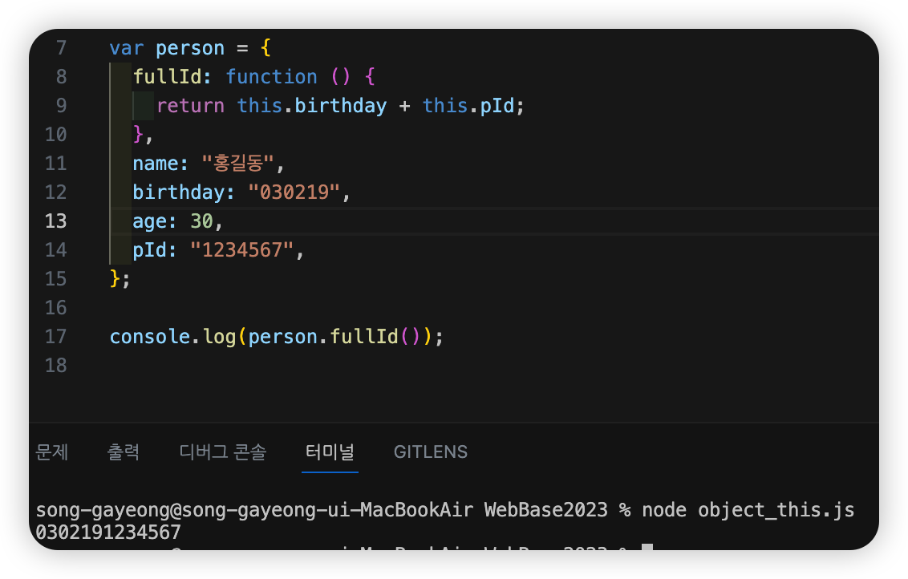
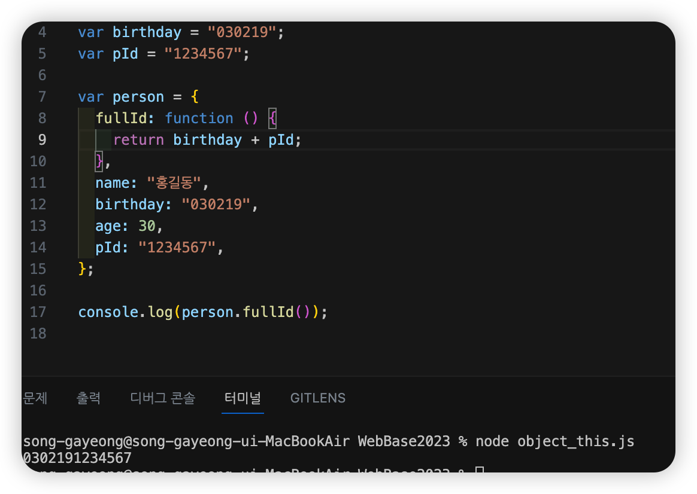
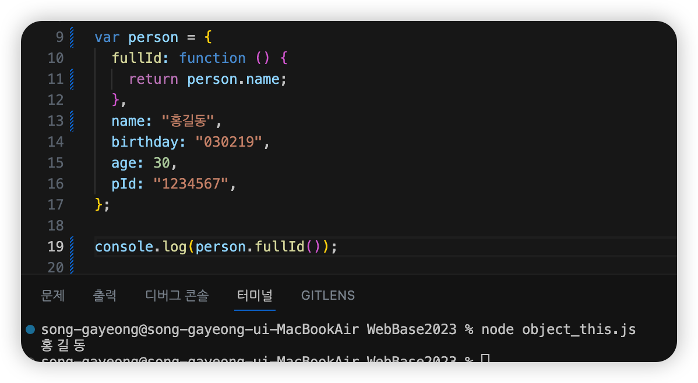

# Object 안에 함수 프로퍼티 안에서 this를 써야하는 이유

## 스코프라고 할 수 있을지도....🤔?

> 그러니깐, 적용되는 영역이 한정되는 것이 아닐까? 어쨌든, '메서드에 있는 객체를 가리킬 때 this 키워드를 사용'함

### 🌟 this가 없을때,

### 🌟 this.를 넣었을때,

#### 아무튼 두 예제를 확인하니 확실한건 this.이 없으면 오류가 발생😟 한다는 사실 !

### 🌟 이런 🩷 예제 🩷는 어떨까?

> this. 가 없는데, 오류가 발생하지 않는다😊 !

## 그렇다. 객체 바깥에 같은 이름으로 변수 선언을 했기 때문이닷 !

> 아 ! this.는 해당 object안에 생성된 프로퍼티인지를 구분하기 위한 것이다.

#### 📌 정리해보면, this를 적음으로써 '나는 너와 같은 object에 생성된 프로퍼티야 !'라는 표시

> 또, 누구를 부르는지 헷갈릴 수 있으니까. object안에 프로퍼티를 부르는건지? 아니면 외부 변수를 부르는건지 구분하기 위함이라고 할 수 있겠지 !

#### 💡 this.가 없음에도 오류가 발생하지 않는 것은 birthday라는 변수가 선언되어 있기 때문!

# 결론: 오류가 발생했던 이유는?

> 💰 오류메세지('birthday is not defined')를 통해서도 확인 할 수 있듯이 this.birthday는 있지만, 변수 birthday가 선언되지 않았기 때문 !

## this.는 알아보기 쉽게 하려고, 혹은 구분하기 쉽게 하기 위함이지 귀찮게 하려는게 아님 ! (뭐, 귀찮은 사람도 있을 수 있음.)

### 그렇게 생각한 이유

#### 해당 객체 변수명을 this 대신 붙여줘도 똑같은 결과값을 얻을 수 있기 때문, 그냥 this는 mine(나의 것)의 느낌으로 받아들이고 쓰먼 되지 않을까?

> 예를 들어 '이거 내 가방이야'랑 '이거 가영이 가방이야'랑 같은 의미니깐.
